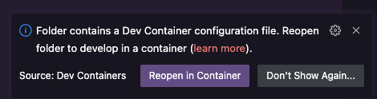
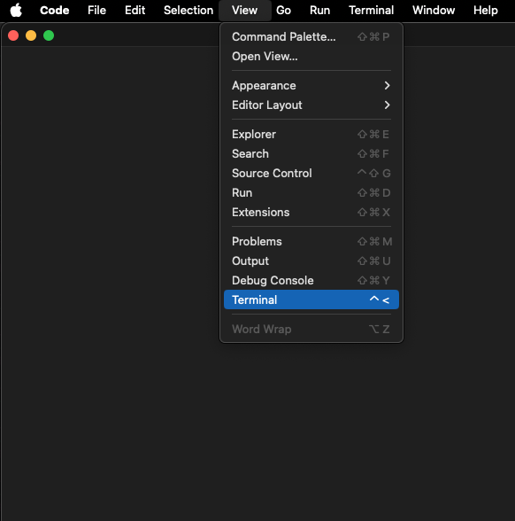

+++
title = "How to use this lab"
draft = false
weight = 1
+++

## How to use this lab
The entire lab consists of one git repo, which contains all necessary things to run it within different environments as independent of the underlying hardware as possible.
This repository consists of two main parts - the tutorial and the hands-on labs. In the tutorial everything you need to know on how to use OpenTelemetry for the labs will get explained. The labs give a hands-on experience on how to use OpenTelemetry in your applications.



The repository utilizes VS Code [Dev Containers](https://code.visualstudio.com/docs/devcontainers/containers) to provide a consistent developer experience across platforms.

### Running the lab remotely

For running the lab in cloud based dev environment you can either use [GitHub Codespaces](https://codespaces.new/JenSeReal/otel-getting-started) or in [Gitpod](https://gitpod.io/#https://github.com/JenSeReal/otel-getting-started).

A requirement to run the lab remotely is a personal GitHub account. You can use this with either Codespaces or Gitpod. 

With both options a VS Instance in your browser will be opened automatically and you are immediately ready to go.

### Running the lab locally

In order to run the lab on your machine you need a local [Docker](https://docs.docker.com/engine/install/), [VS Code](https://code.visualstudio.com/download) and the [Dev Containers extension](https://marketplace.visualstudio.com/items?itemName=ms-vscode-remote.remote-containers)

When using this repo with a locally installed VS Code instance you will be greeted by a prompt in the bottom right corner.

Press `Reopen in Container` to allow VS Code to use the [devcontainer.json](.devcontainer.json) specification to set up the IDE. If you missed the prompt hit <kbd>Ctrl</kbd> + <kbd>Shift</kbd> + <kbd>P</kbd> (on Mac <kbd>Command</kbd> + <kbd>Shift</kbd> + <kbd>P</kbd>) and type `Dev Containers: Rebuild and Reopen in Container`.

After that the [devcontainer spec](.devcontainer.json) will run the [docker-compose.yml](docker-compose.yml) and pull all needed dependencies and build the [Docker Image](Dockerfile) for the application in which we will work on the lab content. To pull all Images and build all containers can take a second, so be patient.

If the terminal is not visible open it under `View/Terminal`

When you run an application that exposes a port, VS Code will notify you that it is accessible. To open the application just click `Open in Browser` or open your Browser manually and type the URL yourself.

When you missed the prompt you can see the open ports in the `PORTS` tab.

## Important differences between local and remote way of running the lab

Even though the experience with using a local or browser based VS Code is fairly similar, one thing you need to take care of is the variation in hostnames and ports.
Whereas on a local environment you can use the combination of `localhost` and the corresponding port. In a remote environment this will not work when trying to access endpoints via a browser.

This is the ports tab of local VS Code environment:

This is the ports tab of a GitHub Codespaces environment:

This is the ports tab of a GitHub Codespaces environment:

Here you can see that they look almost identical. In some case you might have to hover over the address to reveal a link, sometime

